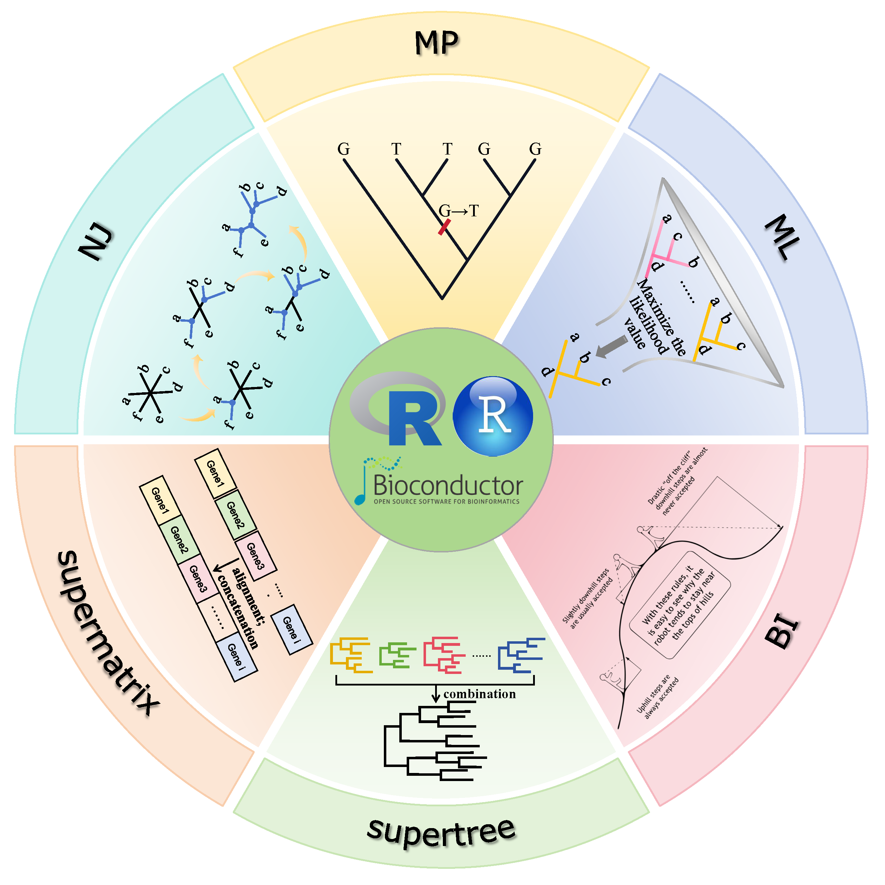

# phylosinR: Common methods for phylogenetic tree construction and their implementation in R # 

 

**phylosinR**: Common methods for phylogenetic tree construction and their implementation in R

## 👩‍🏫👨‍🏫 Author 

Yue Zou1,†, Zixuan Zhang1,†, Yujie Zeng1, Hanyue Hu1, Youjin Hao1, Sheng Huang2,#, Bo Li1,#, *et al.*

1) College of Life Sciences, Chongqing Normal University, Chongqing 401331, China;
2) Animal Nutrition Institute, Chongqing Academy of Animal Science, Chongqing 402460, China. 

- †	These authors contributed equally to this work. # Correspondence: libcell@cqnu.edu.cn (B.L.) and stevenhouse@alu.cqu.edu.cn (S.H.)

 

This is the ***Cover Page*** of project (drawn by *Miss*. Zou)

**Note**: Here we will provide a bioinformatics pipeline for phylogenetic analysis in R, which includes seven steps: 

| No. | Content | Author | Time | Development |
| :----: | :---- | :----: | :----: | :----: |
| 1 | Chunk-01. Loading all aligned DNA sequences | Yue Zou | May. 4th |  |
| 2 | Chunk-02. Constructing phylogenetic tree using NJ | Yue Zou | May. 4th |  |
| 3 | Chunk-03. Constructing phylogenetic tree using MP | Yue Zou | May. 4th |  |
| 4 | Chunk-04. Constructing phylogenetic tree using ML | Yue Zou | May. 4th |  |
| 5 | Chunk-05. Constructing phylogenetic tree using BI | Yue Zou | May. 4th |  |
| 6 | Chunk-06. Constructing phylogenetic tree using Supermatrix strategy | Yue Zou | May. 4th |  |
| 7 | Chunk-07. Constructing phylogenetic tree using Supertree strategy | Yue Zou | May. 4th |  |
| 8 | Chunk-08. To be available... | TBA | TBA |  |
